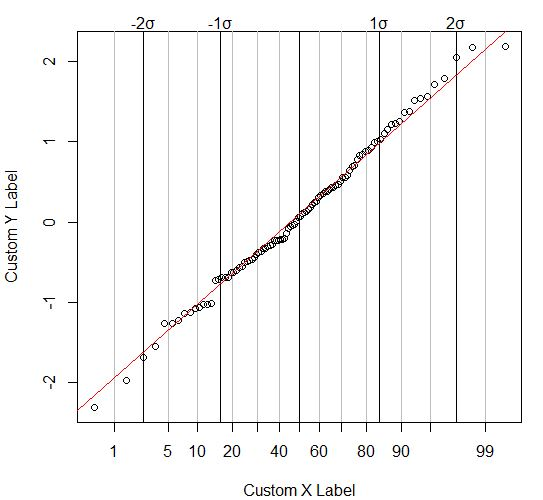
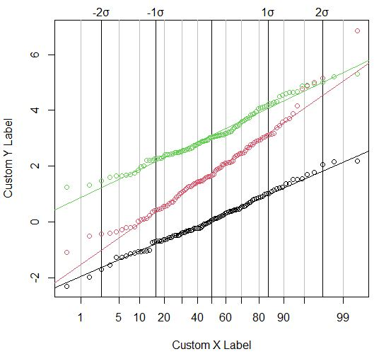

# Probability Plot Functions

This GitHub repository provides R functions for generating probability plots (`probplot_kc` and `probplot_multiple`). Probability plots, also known as quantile-quantile plots, are useful tools for visually assessing the fit of datasets to theoretical distributions.

## Functions

- [`probplot_kc`](probplot_kc.md): Generate a probability plot for a single dataset.
- [`probplot_multiple`](probplot_multiple.md): Generate multiple probability plots for multiple datasets.

## Usage

1. Clone this repository or download the R scripts.
2. Use the functions in your R environment or script.
3. Refer to the function documentation for detailed usage information.

## Examples

Example usage of the functions:

```R
# Load the functions
source("probplot_kc.R")
source("probplot_multiple.R")

# Generate a single probability plot
data <- rnorm(100)
probplot_kc(data)

# Generate multiple probability plots
set.seed(123)
x <- rnorm(100)
y <- rnorm(100, mean = 2, sd = 1.5)
z <- rnorm(100, mean = 3, sd = 1)
probplot_multiple(list(x, y, z))
```

## Example Graphs
A single data set:

Multiple data sets:


## License

This project is licensed under the [MIT License](LICENSE). Feel free to use, modify, and distribute the code according to the terms of the license.
